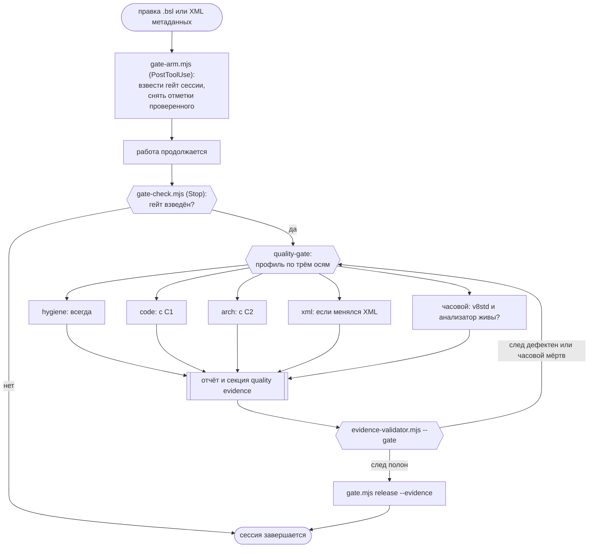

# 1c-quality-gate

[](https://github.com/Romandredan/1c-quality-gate/actions/workflows/validate.yml)
[](https://github.com/Romandredan/1c-quality-gate/releases)
[](https://github.com/Romandredan/1c-quality-gate/commits/main)
[](https://agents.md)

[](https://code.claude.com/docs/en/plugins)
[](LICENSE)
[](https://nodejs.org/)
[](https://v8.1c.ru/)


**Контроль качества 1С-разработки в паре с языковой моделью.** Правка `.bsl` или XML метаданных
взводит гейт — Claude Code не даёт объявить работу законченной, пока проверка не прогнана.
Глубина считается автоматически: косметическая правка закрывается за секунды, транзакция или
новый общий модуль тянут за собой полный разбор. Результат — отчёт с находками и машиночитаемый
след, по которому видно, что проверено, что пропущено и почему.

> **English.** A Claude Code plugin that enforces code-quality checks for 1C:Enterprise (BSL)
> development. Editing a BSL module or a metadata XML arms a session gate: a `Stop` hook refuses
> to end the session until the quality run has happened. Depth is computed per change across
> three axes — volume, code archetypes, complexity — so a comment fix costs seconds while a
> transaction or a new common module triggers the full review. Four review loops cover static
> analysis and 1C development standards, architecture (SOLID and GRASP as applied to 1C),
> metadata XML integrity, and file hygiene. Every run emits a machine-readable evidence trail:
> what was checked, what was skipped, and why. Skills, reports and docs are in Russian.

Значение слов «гейт», «контур», «класс», «след» — в разделе [Термины](#термины).

<details>
<summary><b>Содержание</b></summary>

- [Как выглядит прогон](#как-выглядит-прогон)
- [Зачем это нужно](#зачем-это-нужно)
- [Что проверяется](#что-проверяется)
- [Быстрый старт](#быстрый-старт)
- [Рекомендуемый харнесс](#рекомендуемый-харнесс)
- [Устройство](#устройство)
- [Состав пакета](#состав-пакета)
  - [Оркестратор](#оркестратор)
  - [Контуры](#контуры)
  - [Команды, субагенты и хуки](#команды-субагенты-и-хуки)
- [Термины](#термины)
- [Расчёт глубины](#расчёт-глубины)
  - [Ось 1: объём](#ось-1-объём)
  - [Ось 2: архетипы кода](#ось-2-архетипы-кода)
  - [Ось 3: сложность](#ось-3-сложность)
  - [Сложение осей](#сложение-осей)
- [Порядок прогона](#порядок-прогона)
- [След проверок](#след-проверок)
- [Меры против ложных срабатываний](#меры-против-ложных-срабатываний)
- [Файлы в проекте пользователя](#файлы-в-проекте-пользователя)
- [Настройка под проект](#настройка-под-проект)
- [Скрипты](#скрипты)
- [Структура репозитория](#структура-репозитория)
- [Версии и вклад](#версии-и-вклад)
- [Лицензия](#лицензия)
- [Благодарности и переиспользованное](#благодарности-и-переиспользованное)

</details>

---

## Как выглядит прогон

Модель правит модуль и собирается завершить работу. `Stop`-хук её не отпускает:

```text
[ГЕЙТ КАЧЕСТВА 1С — ЗАВЕРШЕНИЕ ЗАБЛОКИРОВАНО]

В этой работе изменены файлы 1С (2), но Skill: quality-gate не прогонялся.

BSL (2):
  - src/cf/CommonModules/РасчётСкидок/Ext/Module.bsl
  - src/cf/Documents/ЗаказПокупателя/Ext/ObjectModule.bsl

Прогони Skill: quality-gate. Он определит глубину сам — по объёму правки,
архетипам кода и сложности — и запустит только нужные контуры.
Косметическая правка закрывается за секунды: класс C0 требует лишь гигиены файлов.
```

Прогон даёт отчёт: находки для человека, ниже — след для машины.

```text
🔴 Critical  src/cf/CommonModules/РасчётСкидок/Ext/Module.bsl::ПересчитатьСтроки:142
   Запрос внутри цикла по строкам табличной части — одно обращение к БД на строку.
   Правило: #std436, bslls:QueryInLoop · измерено: 1 запрос × N строк при пороге 0
   Исправление: вынести запрос из цикла, получить строки одним пакетом и разложить
   результат в соответствие по ключу.

🟠 Major     src/cf/CommonModules/РасчётСкидок/Ext/Module.bsl::ПересчитатьСтроки:96
   ARCH-A2: ветвление вместо диспетчеризации — цепочка из 6 «ИначеЕсли» по виду скидки
   при пороге ≥4. Каждый новый вид скидки правит этот же метод.
   Целевая структура: соответствие «вид скидки → имя обработчика», обработчики —
   экспортные методы модуля; цепочка сворачивается в один вызов по имени.
   Контр-сигнал не сработал: ветки нетривиальны (12–20 строк) и растут вместе с видами.

## quality evidence

[qg scope: volume=C2, files=2, loc=+64/-11, archetypes=[query,object-event], complexity=[nesting:5], driver=archetype:query, resolved=code:L1+L2|arch:2|xml:n/a|hygiene:full, config=default]
[qg sentinel: target=v8std, id=std454, status=found]
[qg sentinel: target=bslls, id=CommonModuleInvalidType, status=found, engine=bsl-analyzer@0.2.73]
[qg applied: layer=hygiene, scope=file-encoding, ids=[qg:HYG-BOM,qg:HYG-DASH], verdict=clean]
[qg applied: layer=code, scope=query-in-loop, ids=[std436,bslls:QueryInLoop], verdict=violation:std436]
[qg applied: layer=code, scope=query-top-order, ids=[qg:QRY-TOP-WITHOUT-ORDER], verdict=clean]
[qg applied: layer=code, scope=transaction-nesting, ids=[qg:BSL-TXN-IN-HANDLER], verdict=clean]
[qg applied: layer=arch, scope=branching-dispatch, ids=[qg:ARCH-A2], verdict=violation:qg:ARCH-A2]
[qg skipped: layer=xml, reason=not_applicable]
[qg not_verified: dimension=compilation, reason=no_platform]
[qg not_verified: dimension=query-execution, reason=no_platform]
```

У каждой находки ключ локации `путь::Метод:строка`, правило (`#stdNNN`, код диагностики или
идентификатор эвристики), **измеренное значение против порога** и способ исправления; у
архитектурной — ещё целевая структура и проверка контр-сигнала. Уровней три: 🔴 Critical и
🟠 Major блокируют вердикт «чисто», 🟡 Minor не блокирует.

След показывает не только найденное: почему контур XML неприменим, что компилируемость тел
модулей осталась непроверенной и что запрос ни разу не выполнялся. Недоступный анализатор и
отсутствующий индекс кода фиксируются такими же явными записями. Гейт снимается только по корректному следу — его разбирает
`evidence-validator.mjs`, поэтому вердикт проверяем независимо от того, что утверждает отчёт.

---

## Зачем это нужно

Контроль качества в паре с языковой моделью отказывает не из-за незнания стандартов. Отказы
дают пять механизмов.

| Механизм отказа | Последствие | Ответ плагина |
|---|---|---|
| Инструкция «сверяйся со стандартами» не оставляет следа: выполнена она или нет, снаружи неотличимо | непроверенные правки уходят в коммит, отметка «проверено» перестаёт быть информативной | правка файла 1С взводит гейт, снятие возможно только по предъявленному следу |
| Отчёт «чисто» умалчивает о том, что часть проверок была недоступна | синтаксическая ошибка в теле процедуры проявляется при инициализации модуля в базе, а «Неоднозначное поле» в запросе — при первом выполнении | вердикт «чисто» без заявленной компилируемости валидатор отклоняет; сработавший архетип запроса обязан отчитаться, выполнялся ли запрос |
| Инструмент отказал или потерял контекст конфигурации, но продолжает выдавать правдоподобный отчёт | целый класс диагностик гаснет, остальные замечания продолжают поступать | часовой по каждому источнику: подтверждённый `v8std` не заменяет подтверждения анализатора |
| Высокая доля ложных находок | проверку отключают целиком | автоопределение состава проекта, контр-сигнал у каждого архитектурного признака, отдельная обработка неразобранных файлов |
| Полный прогон на правке комментария | гейт начинают обходить | глубина считается по трём осям, на классе `C0` прогон занимает секунды |

Гейт снимается только по корректному следу. Для классов `C0` и `C1` допустимо снятие с
письменной причиной без прогона, для `C2` и `C3` требуется полный прогон.

**Кому адресован:** разработчику 1С, работающему в паре с Claude Code или OpenCode над выгрузкой
конфигурации или расширения в файлы. Плагин задаёт процедуру и критерии приёмки прогона,
содержательный разбор выполняет модель по чеклистам контуров.

**Когда не применяется:** в проектах вне 1С хуки молчат по построению; при чтении чужого кода
гейт не взводится, поскольку реагирует только на правку; при работе в конфигураторе без
выгрузки исходников в файлы проверять нечего.

---

## Что проверяется

| Контур | Предмет | Когда работает |
|---|---|---|
| `code` | диагностики статического анализатора, антипаттерны производительности и механики платформы, стандарты разработки `#stdNNN`, именование, сверка сигнатур API и существования общих модулей; лексические проверки текстов запросов и транзакций в обработчиках событий | с класса `C1` |
| `arch` | распределение ответственности, границы и контракты, связанность модулей, ветвление вместо диспетчеризации, дублирование, переусложнение — SOLID и GRASP в их штатной для 1С реализации | с класса `C2` либо по архетипу |
| `xml` | структура файлов метаданных, форм, СКД, ролей и макетов; дубли структурных узлов; регистрация объекта в составе конфигурации; сверка «диск ↔ состав» в обе стороны; уникальность UUID объектов; права ролей расширения | по факту правки XML |
| `hygiene` | кодировка, BOM, управляющие символы, тире вместо ASCII-дефиса, согласованность переводов строк | всегда, включая `C0` |

Граница между `code` и `arch` проходит по радиусу исправления: умещается внутри тела метода —
код; требует нового шва (выделение метода, перенос в другой модуль, новый экспорт, изменение
«кто кого вызывает») — архитектура.

---

## Быстрый старт

### Установка

**Claude Code:**

```text
/plugin marketplace add Romandredan/1c-quality-gate
/plugin install 1c-quality-gate
```

**OpenCode** — строка в `opencode.json`:

```json
{
  "plugin": ["1c-quality-gate@git+https://github.com/Romandredan/1c-quality-gate.git#v3.0.0"]
}
```

Оба харнесса ставят один и тот же тег одного репозитория: Claude Code — через
`marketplace.json`, OpenCode — через эту строку. Закрепляйте тег: без него OpenCode тянет
текущее состояние `main`, и версии разъезжаются.

После установки перезапустите сессию: навыки материализуются при старте. Проверка
работоспособности: `/gate-status` отвечает «Гейт не взведён». Отличия поведения в OpenCode —
в [docs/OPENCODE.md](docs/OPENCODE.md).

Обязательная зависимость одна: MCP-сервис стандартов `v8std`, объявленный в самом плагине и
работающий по HTTP без настройки. Статический анализатор устанавливается автоматически при
первом прогоне: закреплённый релиз скачивается, сверяется по SHA-256 и размещается в каталоге
данных плагина. Остальное необязательно и расширяет покрытие — см.
[Рекомендуемый харнесс](#рекомендуемый-харнесс) и [docs/INSTALL.md](docs/INSTALL.md).

### Первый вызов

| Задача | Вызов |
|---|---|
| Обычная работа | не требуется: правка взводит гейт, оркестратор запускается перед завершением сессии |
| Прогнать проверку и снять гейт | `/gate` |
| Показать охват взведённого гейта и ожидаемый класс правки | `/gate-status` |
| Поднять глубину против расчётной | `/gate --deep` |
| Минимальный прогон, допустим только для `C0` и `C1` | `/gate --quick` |
| Применить безопасные исправления: именование, форматирование, quick-fix | `/gate --fix` |
| Запустить один контур вне гейта | обращение к навыку контура напрямую |
| Механический чеклист после правки BSL | субагент `bsl-verifier` |
| Снять гейт без прогона, когда правка проверки не требует | `node "$QG/tools/gate.mjs" release --class C0 --reason "<почему>"` |

---

## Рекомендуемый харнесс

Плагин связан с внешними инструментами **по роли, а не по имени продукта**: любой источник,
закрывающий роль, подходит. Ни один из них, кроме `v8std`, не обязателен — недоступный
инструмент даёт запись `skipped` с точной причиной, и прогон продолжается. Мощность падает,
честность — нет.

| Компонент | Роль в прогоне | Без него | Установка |
|---|---|---|---|
| MCP `v8std` — [zeegin/v8std](https://github.com/zeegin/v8std) | тексты стандартов `#stdNNN`, расшифровка диагностик, страницы принципов и паттернов | прогон недостоверен: часовой не подтверждён, гейт не снимается | ничего не нужно: объявлен в [.mcp.json](.mcp.json) плагина, работает по HTTP |
| [bsl-analyzer](https://github.com/itrous/bsl-analyzer) — статический анализ BSL | диагностики контура `code`, метрики для оси сложности | `skipped: reason=analyzer_unavailable` — контур кода остаётся набором инструкций без воспроизводимого вердикта | ставится сам при первом прогоне: закреплённая версия, сверка SHA-256 |
| Python 3.8+ и `lxml` | 10 валидаторов XML метаданных | контур `xml` теряет валидацию файлов; сверка «диск ↔ состав» на Node остаётся в строю | `pip install lxml` |
| Индекс кода 1С — MCP [rlm-tools-bsl](https://github.com/Dach-Coin/rlm-tools-bsl) или аналог | граф вызовов: вызывающие, экспорты модуля, использования символа, состав метаданных | признаки `ARCH-A1`, `ARCH-A7`, `ARCH-A9`, `ARCH-A11` уходят в `skipped: reason=rlm_unavailable`, а не в зелёный вердикт | по инструкции проекта-источника |
| Справочник API платформы — MCP [mcp-bsl-platform-context](https://github.com/alkoleft/mcp-bsl-platform-context) или аналог | сигнатуры методов и типов платформы при верификации вызовов | `skipped: reason=platform_unavailable`, сверка API выполняется частично | по инструкции проекта-источника |
| Платформа 1С:Предприятие 8.3 | проверка конфигурации (`/CheckConfig`) — единственный способ узнать, компилируются ли тела модулей | `not_verified: dimension=compilation, reason=no_platform` в каждом чистом вердикте | локальная установка платформы |

Минимальная рабочая связка — Claude Code и плагин: гигиена, стандарты и архитектурные признаки
без графа вызовов работают сразу. Рекомендуемая — плюс анализатор (ставится сам), `lxml` и
индекс кода: она закрывает контур `code` воспроизводимым вердиктом и включает четыре
архитектурных признака, которые иначе честно пропускаются.

---

## Устройство

Четыре слоя, каждый отвечает на свой вопрос.

| Слой | Вопрос | Триггер | Состав |
|---|---|---|---|
| 0. Механика гейта | будет ли проверка прогнана | правка файла 1С (`PostToolUse`), попытка завершить сессию (`Stop`) | 2 хука, `tools/gate.mjs` |
| 1. Профиль изменения | на какой глубине проверять эту правку | вызов `quality-gate` | оркестратор: три оси, матрица глубин, `driver` |
| 2. Контуры | что не так с кодом, архитектурой, метаданными, байтами | глубина, назначенная слоем 1 | 4 навыка, анализатор, 10 валидаторов XML, MCP `v8std` |
| 3. След и снятие | что проверено, что пропущено и почему | завершение прогона | формат следа, `evidence-validator.mjs`, `gate.mjs release` |

Два инварианта.

**Профиль считается один раз**, до запуска контуров. Контуры получают его готовым и не
пересчитывают: иначе оси расходятся, и обоснование выбранной глубины перестаёт быть
проверяемым задним числом.

**Пропуск фиксируется.** Контур возвращает либо `applied`, либо `skipped` с причиной. Слой, не
оставивший записи, неотличим от выполненного, и это обесценивает весь механизм.

---

## Состав пакета

### Оркестратор

| Навык | Назначение | Входы | Выходы |
|---|---|---|---|
| [`quality-gate`](skills/quality-gate/SKILL.md) | Единственная точка входа. Считает профиль изменения, выбирает глубину каждого контура, запускает контуры, проверяет часового, собирает отчёт и снимает гейт. Контуры напрямую не вызываются. | `git diff` по рабочему дереву либо явно названные файлы; `gate.mjs status` (охват и отметки проверенного); `.1c-quality-gate.json` (пороги проекта) | отчёт с находками, секция `## quality evidence`, снятый гейт, запись в журнале `qg-done.json` |

### Контуры

| Контур | Навык | Условие запуска | Предмет проверки | Инструменты |
|---|---|---|---|---|
| `hygiene` | [`file-hygiene`](skills/file-hygiene/SKILL.md) | всегда, включая класс `C0` | валидность UTF-8, BOM у модулей и XML, управляющие символы, тире вместо ASCII-дефиса вне строковых литералов, смешанные переводы строк | `tools/hygiene-check.mjs` по явному списку файлов |
| `code` | [`bsl-code-review`](skills/bsl-code-review/SKILL.md) | с `C1` слой 1; на `C2` дополнительно слой 2; на `C3` те же слои плюс предложение слоя 3 | слой 1а: диагностики статического анализатора. Слой 1б: антипаттерны производительности и механики платформы, [антипаттерны кода языковой модели](skills/bsl-code-review/references/ai-antipatterns.md), затенение колонки псевдонимом источника и `ПЕРВЫЕ N` без `УПОРЯДОЧИТЬ ПО` в тексте запроса, собственная транзакция внутри неявной транзакции обработчика, строковая колонка без квалификатора длины у таблицы-параметра запроса, стандарты под архетип, именование, сверка сигнатур API и существования общих модулей. Слой 2: ревью логики моделью | `tools/analyzer-run.mjs`, `tools/query-lint.mjs`, `tools/bsl-lint.mjs`, `tools/rename-check.mjs`, MCP `v8std`; при наличии индекс кода и справочник API платформы |
| `arch` | [`bsl-architecture-review`](skills/bsl-architecture-review/SKILL.md) | с `C2` уровни 1-2, на `C3` уровень 3; архетип поднимает уровень независимо от класса | одиннадцать признаков `ARCH-A1…A11`: модуль-комбайн, ветвление вместо полиморфизма, дубль-алгоритм, параллельная коллекция, перекладка переменных, инлайн-конструирование контракта, дублирующая валидация, инфраструктура в прикладном коде, экспорт без потребителей, переусложнение, проверки по обе стороны вопроса пользователю | [`signs-map.json`](skills/bsl-architecture-review/references/signs-map.md) с сигналом, порогом и контр-сигналом, MCP `v8std`, индекс кода |
| `xml` | [`xml-structure-review`](skills/xml-structure-review/SKILL.md) | по факту правки XML метаданных, независимо от объёма | сверка «диск ↔ состав» в обе стороны; уникальность UUID объектов метаданных; валидация файлов объектов, форм, СКД, ролей, подсистем, макетов, командного интерфейса; права на объекты в ролях расширения с [контр-сигналами модели прав](skills/xml-structure-review/references/role-rights-model.md); [различение собственного и заимствованного](skills/xml-structure-review/references/cfe-object-belonging.md) в расширении; дефекты, проходящие валидацию | `tools/xml/orphan-check.mjs`, `tools/xml/uuid-unique.mjs`, 10 валидаторов Python в `tools/xml/` |

Правила дедупликации находок по ключу локации и шкала severity приведены в
[shared/routing-contract.md](shared/routing-contract.md).

### Команды, субагенты и хуки

| Компонент | Тип | Назначение |
|---|---|---|
| [`/gate`](commands/gate.md) | команда | прогон `quality-gate` целиком и снятие гейта; принимает `--deep`, `--quick`, `--fix` |
| [`/gate-status`](commands/gate-status.md) | команда | охват взведённого гейта и ожидаемый класс правки; гейт не снимает |
| [`bsl-verifier`](agents/bsl-verifier.md) | субагент | механический чеклист после правки `.bsl`: сигнатуры платформы, существование и экспортность общих модулей, состав метаданных, диагностики, именование. Логику и архитектуру не проверяет |
| [`bsl-scout`](agents/bsl-scout.md) | субагент | факты из индекса кода для контура архитектуры: вызывающие, экспорты модуля, триггеры экспорта в XML. Вердиктов не выносит |
| [`xml-runner`](agents/xml-runner.md) | субагент | прогон сверки «диск ↔ состав» и валидаторов структуры по изменённым файлам, разбор их вывода в короткий вердикт |
| [`gate-arm.mjs`](hooks/gate-arm.mjs) | хук `PostToolUse` | взводит гейт на правках `.bsl`, `.os` и XML метаданных, снимает с файла отметки проверенного; в не-1С проектах молчит |
| [`gate-check.mjs`](hooks/gate-check.mjs) | хук `Stop` | блокирует завершение своей сессии, пока гейт не снят; при внутренней ошибке завершается кодом 0 без сообщения |
| `v8std` | MCP | тексты стандартов `#stdNNN` и расшифровка диагностик во время прогона; объявлен в [.mcp.json](.mcp.json) |

---

## Термины

| Термин | Значение |
|---|---|
| Гейт | Блокировка завершения сессии. Правка файла 1С взводит гейт; пока прогон не выполнен и след не предъявлен, сессия не закрывается. |
| Контур | Одна из четырёх проверок: `code`, `arch`, `xml`, `hygiene`. |
| Класс | Оценка объёма правки: `C0` косметика, `C1` точечная, `C2` модульная, `C3` структурная. |
| Архетип | Метка вида кода в правке: запрос, транзакция, права, интеграция и другие. У каждой метки объявлен свой минимум глубины, поэтому три строки внутри транзакции проверяются глубже, чем триста строк переименований. |
| Профиль изменения | Результат расчёта по трём осям: класс объёма, набор сработавших архетипов, оценка сложности. Определяет, какие контуры запускаются и на какой глубине. |
| След (evidence) | Секция `## quality evidence` в конце отчёта, по строке на каждую проверку: что выполнено, что пропущено и по какой причине. Без корректного следа гейт не снимается. |
| Часовой (sentinel) | Проверка живости источника, на который опирается вердикт. Для `v8std` запрашивается заведомо существующий стандарт, для анализатора прогоняется фикстура с заведомой ошибкой. Неподтверждённый источник делает прогон недостоверным. |

Грамматика следа и полный перечень причин пропуска приведены в
[evidence-format.md](skills/quality-gate/references/evidence-format.md).

---

## Расчёт глубины

Три оси, считаются один раз до запуска контуров.

### Ось 1: объём

| Класс | Признаки |
|---|---|
| `C0` косметика | комментарии, форматирование, переименование без смены семантики; тела методов не менялись |
| `C1` точечная | 1 файл, не более 40 изменённых строк, правка внутри существующих методов; нет новых экспортов, изменённых сигнатур, новых модулей и объектов метаданных |
| `C2` модульная | более одного метода, либо новый экспортный метод, либо изменённая сигнатура, либо более 40 строк, либо более одного файла, в пределах существующих модулей |
| `C3` структурная | новый модуль, объект метаданных или форма, либо изменение проведения и бизнес-логики, либо новая интеграция, либо затронуто 4 и более модулей разных подсистем |

### Ось 2: архетипы кода

Архетипы образуют набор меток, а не шкалу. Расставляются механически по маркерам в диффе и
путям файлов; одна правка может нести несколько меток одновременно: запрос, транзакция и
блокировки, запись наборов записей, обработчик события объекта, интеграция и HTTP, права и
RLS, CFE-перехват, регламентное и фоновое задание, клиент-сервер, модуль формы, асинхронный
клиент, новый общий модуль, новый объект метаданных.

У каждой метки объявлен собственный минимум для контуров `code` и `arch`. Транзакция требует
минимум `code` L2, но `arch` не поднимает вовсе; новый общий модуль наоборот оставляет `code`
на L1, а `arch` поднимает до уровня 2. Полная таблица меток с порогами и маркерами приведена
в [навыке `quality-gate`](skills/quality-gate/SKILL.md).

### Ось 3: сложность

Ось закрывает случай «строк мало, но код тяжёлый», когда архетип может не сработать вовсе.
Срабатывает при вложенности от 4, длине метода свыше 120 строк, 7 и более параметрах, цепочке
ветвлений от 4, рекурсии. Метрики берутся из отчёта анализатора.

### Сложение осей

Базовая матрица по объёму:

| Контур | `C0` | `C1` | `C2` | `C3` |
|---|---|---|---|---|
| `hygiene` | полный | полный | полный | полный |
| `code` | пропуск | L1 | L1 + L2 | L1 + L2, предложить аудит |
| `arch` | пропуск | пропуск | ур. 1-2 | ур. 3 |
| `xml` | пропуск | не применим, если XML не менялся | изменённые объекты плюс регистрация | полный: валидация, сироты в обе стороны, права ролей |
| компилируемость | не требуется | если платформа доступна | да | да |

> глубина контура = max(по объёму, максимум минимумов по сработавшим архетипам, по сложности)

Вторая ось введена из-за асимметрии: три строки внутри транзакции опаснее трёхсот строк
переименований, но транзакции нужен глубокий разбор *кода*, а новому общему модулю на тридцать
строк нужен разбор *архитектуры*. Одномерным «множителем риска» это не выражается.

Отдельно фиксируется `driver`: что именно подняло глубину, объём, конкретный архетип или
сложность. Без него вердикт виден, а его логика нет, и первое же «почему так долго на трёх
строках» превращается в спор.

Понижающий модификатор называется эталонной правкой. Глубина опускается до `C1` независимо от объёма при
одновременном выполнении трёх условий: все фрагменты являются кальками типового эталона того же
механизма с точечной адаптацией имён и полей; они уже прошли предметный верификатор с нулём
ошибок; они не затрагивают транзакции, блокировки и права.

---

## Порядок прогона



Диаграмма иллюстративна; нормативный порядок шагов приведён в
[навыке `quality-gate`](skills/quality-gate/SKILL.md).

Последовательность одного прогона:

1. Собрать охват: `gate.mjs status` и `git diff`. Слои, уже отработавшие по этому содержимому
   файла, пропускаются с причиной `verified_earlier`. Отметку снимает любая следующая правка,
   поэтому переиспользование устаревшего доказательства исключено по построению.
2. Посчитать профиль по трём осям и зафиксировать `driver`.
3. Прогнать контуры на назначенной глубине. Недоступный инструмент даёт `skipped` с точной
   причиной: `analyzer_unavailable`, `rlm_unavailable`, `platform_unavailable` и другими.
4. Проверить часового по каждому источнику, на который опирается вердикт `clean`: заведомо
   существующий стандарт через `v8std`, заведомо неверную фикстуру через анализатор.
5. Собрать отчёт: находки для человека, ниже секция `## quality evidence`.
6. Проверить след валидатором и снять гейт командой `gate.mjs release --evidence`.

Слой 3, состязательный аудит, автоматически не запускается. Контуры предлагают его в отчёте
при классе `C3` с находками 🔴 или 🟠; запуск только после явного согласия. Методология
приведена в [adversarial-audit.md](skills/quality-gate/references/adversarial-audit.md).

---

## След проверок

Пример полного следа приведён выше, в разделе [Как выглядит прогон](#как-выглядит-прогон):
он показывает не только найденное, но и причину, по которой контур XML неприменим, и то, что
компилируемость осталась непроверенной.

| Тип записи | Смысл | Обязательные поля |
|---|---|---|
| `scope` | профиль изменения, ровно одна запись за прогон | `volume`, `files`, `archetypes`, `driver`, `resolved`, `config` |
| `applied` | проверка выполнена | `layer`, `scope`, `ids`, `verdict` |
| `skipped` | слой можно было прогнать, но он не требовался либо инструмент недоступен | `layer`, `reason` |
| `not_verified` | измерение непроверяемо доступными средствами | `dimension`, `reason` |
| `sentinel` | источник подтвердил в этом прогоне, что жив | `target`, `status` |

Поле `config` в записи `scope` — настройка проекта, применённая к прогону: `default` либо
`custom:<секция>` с перечнем переопределённых. Строку печатает `config.mjs show`, и без неё
гейт не снимается: «C1» в проекте с задранными порогами означает не то же, что «C1» рядом, а
прогон, не заглянувший в настройку, иначе неотличим от прогона, который её учёл. Валидатор
**сверяет** отметку с фактической настройкой — приписанное по памяти значение не пройдёт.

Проверка следа:

```bash
node "$QG/tools/evidence-validator.mjs" <файл отчёта>          # lint: только оформление
node "$QG/tools/evidence-validator.mjs" <файл отчёта> --gate   # строгий, для снятия гейта
```

Строгий режим требует ровно одну запись `scope`, хотя бы одну `applied` или `skipped`,
подтверждённого часового по каждому источнику, на который опирается вердикт `clean`, заявленную
компилируемость при полностью чистом вердикте и — если сработал архетип запроса — заявленное
исполнение запроса. Грамматика и перечень причин приведены в
[evidence-format.md](skills/quality-gate/references/evidence-format.md).

**Проверка с инструментом заявляется только по прогону.** Строку следа пишет в отчёт модель, и
написанная по прочтении кода она неотличима от полученной прогоном. Поэтому инструменты
печатают свою строку сами и отмечаются в журнале `.claude/.state/qg-runs.jsonl`, а валидатор
сверяет с ним каждую запись `applied`, у чьей проверки инструмент есть: `static-analysis`,
`query-alias-shadowing`, `query-top-order`, `transaction-nesting`, `enum-string-assign`,
`unbounded-string-column`, `attribute-access`, `file-encoding`, `registration-check`,
`uuid-uniqueness`, `structure-validation`. Отметка должна быть не старше
последней правки файлов своей сессии — прогон до правки описывает состояние, которого уже нет.

**Сверяется и покрытие.** В журнале лежат пути файлов, которые инструмент видел; они
сопоставляются с составом правки, и прогон по одному файлу из десяти заявление обо всех десяти
не закрывает. Прогоны складываются — гонять инструмент по частям законно. Непокрытый файл
блокирует там, где инструмент применим к любому файлу своего расширения, и предупреждает для
проверки структуры: часть служебных XML выгрузки не проверяет ни один валидатор.

Запись `skipped` с причиной `not_applicable` проверяется наравне с `applied` — это тоже
утверждение о работе инструмента («посмотрел файлы, правило к ним не относится»). Причины
вида `analyzer_unavailable` отметки не требуют: ставить её некому.

Что сверка **не** делает: она не защищает от записи, дописанной в журнал вручную. В отличие от
поля `config`, где истина заново выводится с диска, независимого источника здесь нет — это
обнаружение молчания, и не больше.

Имена проверок берутся из закрытого словаря (`tools/evidence-scopes.mjs`). Свободное имя
проходило бы формат, но не закрывало бы ни одного требования — а выглядело бы проверкой.

Оба требования об одном и том же. Компилируемость тел BSL не проверяют ни загрузка конфигурации
из файлов, ни выгрузка, ни валидаторы XML: они разбирают структуру, но тела не компилируют.
Синтаксическая ошибка внутри процедуры проходит их все и проявляется только при инициализации
модуля в базе. Текст запроса не проверяет и это: для анализатора, сборки и валидаторов он
остаётся строковым литералом, а «Неоднозначное поле» или «Поле не найдено» всплывают при первом
выполнении. Вердикт «чисто», умалчивающий об этом, закрывает вопрос фальшивой зеленью.

---

## Меры против ложных срабатываний

Ложная находка обходится дороже пропущенной: она провоцирует переделку работающего кода, и
после двух-трёх таких случаев проверку отключают целиком. Отсюда шесть конструктивных решений.

**Состав проекта определяется автоматически:** основная конфигурация подключается к анализу
вместе с расширениями. Расширение, разобранное в одиночку, не видит библиотек, и каждое
обращение к ним становится «неразрешённым вызовом». На боевых расширениях это давало треть всех
находок.

**Неразобранные файлы называются неразобранными**, а не источником трёхсот проблем. Замечания
по ним получены на обрывке синтаксического дерева и снимаются целиком.

**Диагностики с высокой долей ложных на идиоматичном коде 1С отключены** в гейтовом конфиге, а
типографика и форматирование вынесены в отдельный дешёвый контур.

**Пороги проекта и пороги гейта разделены.** Анализатор запускается с конфигом из состава
плагина: иначе отключённая в проекте диагностика делала бы гейт тише, и об этом никто бы не
узнал.

**Контр-сигнал обязателен** для каждого архитектурного признака: это законная форма, в которой
признак не является дефектом. Новая проверка без контр-сигнала не принимается.

**Отсутствие данных не превращается в «чисто».** Признаки `ARCH-A1`, `ARCH-A7`, `ARCH-A9` и `ARCH-A11`
опираются на граф вызовов, поэтому без индекса кода уходят в `skipped`, а не в зелёный вердикт.

Замеры на боевом коде: [docs/false-positives-cfe.md](docs/false-positives-cfe.md). Обоснование
выбора анализатора и его ограничения:
[docs/analyzer-integration.md](docs/analyzer-integration.md).

---

## Файлы в проекте пользователя

```text
<корень проекта>/
├── .1c-quality-gate.json           настройка: пороги осей, движок анализатора, архетипы, часовой
└── .claude/.state/
    ├── qg-pending.json             взведённые гейты по сессиям и отметки проверенного (файл × слой)
    ├── qg-done.json                журнал снятий: класс, причина, охват, предупреждения валидатора
    ├── qg-runs.jsonl               журнал прогонов инструментов: чем и когда проверено на самом деле
    ├── qg-config-init.json         отметка, что настройка уже создавалась
    └── qg-analyzer.toml            сгенерированный конфиг анализатора с найденным составом проекта
```

Корень проекта инструменты определяют одинаково: переменная `CLAUDE_PROJECT_DIR`, иначе подъём
до `.1c-quality-gate.json`, иначе до `.git`. Пока каждый инструмент брал рабочий каталог,
запуск из подкаталога давал «настройки нет» и «гейт не взведён» — оба ответа неотличимы от
честных.

Состояние гейта разделено по сессиям: завершение блокируется только за файлы текущей сессии,
правки соседней выводятся информационной строкой. Снятие чужого гейта недопустимо, поскольку
объявляет проверенной работу, которая не просматривалась.

В `.gitignore` проекта добавляются `.claude/.state/` (рабочее состояние сессии) и
`.qg-analyzer/` (временный каталог отчёта запасного движка).

---

## Настройка под проект

**Файл заводит плагин, а не пользователь.** `.1c-quality-gate.json` создаётся при первом
взводе гейта — раньше неизвестно, что проект вообще на 1С. Секции в нём пустые, с описанием
ключей внутри: проставленное умолчание закрепилось бы навсегда и пережило бы обновление
плагина, поменявшее это умолчание. Удалённый файл повторно не создаётся — удаление читается
как отказ.

Что действует прямо сейчас — с указанием источника каждого значения (умолчание, файл,
переменная окружения):

```bash
node "$QG/tools/config.mjs" show
```

Эту же команду выполняет оркестратор до расчёта осей: пороги берутся из вывода, а не по
памяти.

```json
{
  "analyzer": { "engine": "bsl-analyzer", "version": "0.2.73", "required": false },
  "volume": { "c1MaxLines": 40, "c1MaxFiles": 1 },
  "complexity": { "maxNesting": 4, "maxMethodLines": 120, "maxParams": 7 },
  "archetypes": {
    "custom": [
      { "name": "exchange", "markers": ["ПланОбмена", "ОбменДанными.Загрузка"], "minCode": "L2" }
    ]
  },
  "sentinel": { "id": "std454" }
}
```

| Параметр | Где задаётся |
|---|---|
| Движок анализатора, закрепление версии, обязательность, автоустановка | `analyzer.*` либо переменные окружения `QG_ANALYZER_*` |
| Пороги трёх осей и собственные архетипы проекта | `volume`, `complexity`, `archetypes.custom` |
| Номер стандарта для часового по `v8std` | `sentinel.id` — если исчезнет именно эта страница, часовой упадёт разом во всех проектах |
| Разовое отклонение от расчётной глубины | флаги `/gate --deep` и `/gate --quick` |

Приоритет: переменная окружения → файл → умолчание. Неизвестный ключ не применяется, но и не
замалчивается: `show` называет его отдельной строкой — опечатка в имени иначе неотличима от
настройки, которой нет. Полный справочник — [docs/CONFIG.md](docs/CONFIG.md).

При `analyzer.required: true` гейт без анализатора не снимается. По умолчанию установлено
`false`: плагин публичный, у стороннего пользователя анализатора может не быть, и контур в этом
случае пишет `skipped`, а прогон продолжается. В собственных проектах значение следует
переключить на `true`. Установка, обновление и диагностика разобраны в
[docs/INSTALL.md](docs/INSTALL.md).

---

## Скрипты

Команды используют `$QG`, каталог установленного плагина. Переменная `CLAUDE_PLUGIN_ROOT`
доступна хукам, но не оболочке; способ разрешить путь первой командой прогона описан в разделе
«Путь к инструментам плагина» навыка [`quality-gate`](skills/quality-gate/SKILL.md).

Механика гейта и следа:

```bash
node "$QG/tools/gate.mjs" status                                   # охват, сессии, отметки проверенного
node "$QG/tools/gate.mjs" verify --layer code <файл> [...]         # отметить слой проверенным
node "$QG/tools/gate.mjs" release --evidence <файл отчёта>         # снять гейт по следу
node "$QG/tools/gate.mjs" release --class C0 --reason "<почему>"   # снять без прогона (только C0 и C1)
node "$QG/tools/evidence-validator.mjs" <файл отчёта> --gate       # проверить след
node "$QG/tools/config.mjs" show                                  # действующие пороги и их источник
```

Проверки контуров:

```bash
node "$QG/tools/analyzer-run.mjs" --changed <файл> [...]   # статический анализ, часовой, записи следа
node "$QG/tools/analyzer-run.mjs" --sentinel               # только проверка живости анализатора
node "$QG/tools/analyzer-bootstrap.mjs" [--verify]         # установка анализатора и сверка SHA-256
node "$QG/tools/hygiene-check.mjs" <файл> [...]            # байтовая гигиена
node "$QG/tools/query-lint.mjs" <файл.bsl|.xml> [...]      # тексты запросов (включая <query> СКД и динсписки): затенение колонки, ПЕРВЫЕ N без порядка
node "$QG/tools/bsl-lint.mjs" <файл.bsl> [...]             # транзакция в обработчике; примитив в поле ссылочного типа; строковая колонка без квалификатора длины
node "$QG/tools/rename-check.mjs" <файл.bsl> [...]         # вызов метода, объявление которого исчезло из модуля в этой правке
node "$QG/tools/xml/orphan-check.mjs" <каталог выгрузки>   # сверка «диск ↔ состав» в обе стороны
node "$QG/tools/xml/uuid-unique.mjs" <каталог выгрузки>    # дубли UUID объектов метаданных
python "$QG/tools/xml/meta-validate.py" -Path "<путь>"     # валидаторы XML; -Path принимают все
```

Коды выхода: `0` чисто, `1` предупреждения или «не найдено», `2` блокирующая ошибка.

Работа над самим плагином, то же выполняет CI на каждый push:

```bash
node tests/run-tests.mjs             # тесты программных проверок
node tools/validate-package.mjs      # целостность пакета, ссылки, утечки проектных данных
node tools/gen-signs-map-md.mjs      # перегенерация signs-map.md, если менялся signs-map.json
```

---

## Структура репозитория

| Путь | Содержимое |
|---|---|
| [skills/quality-gate/](skills/quality-gate/SKILL.md) | оркестратор: три оси, матрица глубин, формат следа, состязательный аудит |
| [skills/bsl-code-review/](skills/bsl-code-review/SKILL.md) | контур кода и справочники: стандарты, антипаттерны, оптимизация запросов, сверка API |
| [skills/bsl-architecture-review/](skills/bsl-architecture-review/SKILL.md) | контур архитектуры, карта признаков `signs-map.json`, паттерны в 1С |
| [skills/xml-structure-review/](skills/xml-structure-review/SKILL.md) | контур XML метаданных, модель прав ролей, семантика заимствования в расширении |
| [skills/file-hygiene/](skills/file-hygiene/SKILL.md) | контур гигиены файлов |
| [agents/](agents/bsl-verifier.md), [commands/](commands/gate.md) | субагенты-верификатор и разведчик, слэш-команды |
| [hooks/](hooks/hooks.json) | взвод гейта на правке, блокировка завершения сессии |
| [tools/](tools/gate.mjs) | исполняемые проверки: Node.js без зависимостей, валидаторы XML на Python |
| [shared/](shared/routing-contract.md) | знание, общее для нескольких навыков: контракт маршрутизации |
| [assets/analyzer/](assets/analyzer/runtime-manifest.json) | гейтовые конфиги движков, закреплённая версия с суммами, фикстура часового |
| [tests/](tests/run-tests.mjs) | самодостаточный раннер; фикстуры с байтовой семантикой генерируются, а не хранятся |
| [docs/](docs/INSTALL.md) | установка, интеграция анализатора, замеры ложных срабатываний, порядок выпуска релизов |
| [.github/workflows/](.github/workflows/validate.yml) | CI: проверка на каждый push и выпуск релиза по тегу |

---

## Версии и вклад

Версия хранится в одном месте, [.claude-plugin/plugin.json](.claude-plugin/plugin.json), и
держится синхронно с `marketplace.json`; расхождение обнаруживает `validate-package.mjs`.

Релизы помечаются аннотированными тегами `vX.Y.Z`, и запись плагина в маркетплейсе пиннится на
тег полем `source.ref`: `main` остаётся рабочей веткой, а устанавливается только помеченное
дерево. Описание релиза живёт в сообщении тега, отдельного CHANGELOG в репозитории нет.

```bash
git tag -l                             # список релизов
git tag -n99 vX.Y.Z                    # описание релиза
git log --oneline vX.Y.Z..vA.B.C       # что вошло между релизами
```

Порядок выпуска, нумерация и шаблон описания приведены в [docs/RELEASING.md](docs/RELEASING.md).
Номер версии отвечает на вопрос «придётся ли что-то делать руками»: MAJOR — да (настройка,
расположение состояния, имена инструментов и проверок, флаги CLI), MINOR — гейт стал строже
или умнее в прежнем контракте. Новое блокирующее требование выходит в два шага: сначала
предупреждением, ошибкой — следующим релизом, чтобы обновление не красило чужой рабочий
процесс без предупреждения.

Правила добавления проверок и требования к PR приведены в [CONTRIBUTING.md](CONTRIBUTING.md),
инструкции для агента, работающего над самим плагином, в [CLAUDE.md](CLAUDE.md) и
[AGENTS.md](AGENTS.md). Основное требование: новая проверка сопровождается двумя тестами, один
подтверждает обнаружение дефекта, второй молчание на заведомо корректном коде. Для
архитектурного признака дополнительно обязателен контр-сигнал. Перед PR выполняется локальный
прогон `node tests/run-tests.mjs` и `node tools/validate-package.mjs`, CI должен быть зелёным.

Язык пакета русский: тела навыков, справочники и отчёты пишутся по-русски, код, команды,
идентификаторы и номера стандартов остаются в оригинале.

---

## Лицензия

Код, скрипты, чеклисты, карты соответствий и эвристики этого репозитория распространяются по
MIT, см. [LICENSE](LICENSE).

Тексты стандартов разработки 1С не воспроизводятся. Плагин публикует только ссылки и номера
вида `#stdNNN`, а сами тексты получает во время работы через MCP-сервис `v8std`. Правила
изложены авторами своими словами со ссылкой на номер стандарта.

---

## Благодарности и переиспользованное

Плагин опирается на результаты других проектов. Ничто из перечисленного в пакет не входит:
анализаторы скачиваются с релизов своих авторов и запускаются как внешние процессы, тексты
стандартов запрашиваются по сети во время прогона. Лицензии относятся к самим этим компонентам,
а не к коду плагина.

| Проект | Автор | Лицензия | Что взято и как используется |
|---|---|---|---|
| [cc-1c-skills](https://github.com/Nikolay-Shirokov/cc-1c-skills) | Nick Shirokov | MIT | десять валидаторов XML метаданных в `tools/xml/*.py`, портированы с адаптацией под контур `xml`; ссылка на источник и уведомление об авторских правах сохранены в шапке каждого файла |
| [bsl-analyzer](https://github.com/itrous/bsl-analyzer) | itrous | LGPL-3.0-or-later | основной движок статического анализа: закреплённый релиз скачивается при первом прогоне, сверяется по SHA-256 и вызывается консольно |
| [bsl-language-server](https://github.com/1c-syntax/bsl-language-server) | 1c-syntax | LGPL-3.0 | запасной движок анализа, устанавливается пользователем, вызывается консольно |
| [v8std](https://github.com/zeegin/v8std) · [v8std.ru](https://v8std.ru/) | zeegin | CC0 1.0 | MCP-сервис `ai.v8std.ru`: тексты стандартов по номеру, расшифровка диагностик, страницы принципов SOLID, GRASP и паттернов, на которые ссылается карта архитектурных признаков |
| [ai_rules_1c](https://github.com/comol/ai_rules_1c) | Oleg Philippov | не указана | идеи трёх проверок: уникальность UUID объектов метаданных, собственная транзакция внутри неявной, `ПЕРВЫЕ N` без `УПОРЯДОЧИТЬ ПО`. Правила изложены своими словами и сверены со стандартами; тексты и примеры не переносились |
| Стандарты разработки 1С:Предприятие, ИТС | 1С | правообладатель | номера `#stdNNN` и ссылки; тексты в репозитории не воспроизводятся |
| Claude Code | Anthropic | нет | среда выполнения: механика плагинов, навыков, субагентов и хуков, на которой держится гейт |

Совместимые внешние источники фактов — индекс кода
[rlm-tools-bsl](https://github.com/Dach-Coin/rlm-tools-bsl) и справочник API платформы
[mcp-bsl-platform-context](https://github.com/alkoleft/mcp-bsl-platform-context) — в пакет не
входят и подключаются пользователем как отдельные MCP-серверы; связь с ними идёт по роли, а не
по имени продукта.

Авторам обоих анализаторов отдельная признательность: без них контур кода остался бы набором
инструкций для модели без воспроизводимого вердикта. Плагин не зеркалит их сборки и не изменяет
условий их лицензий, он закрепляет версию и сверяет контрольную сумму, чтобы вердикт не менялся
между прогонами.
